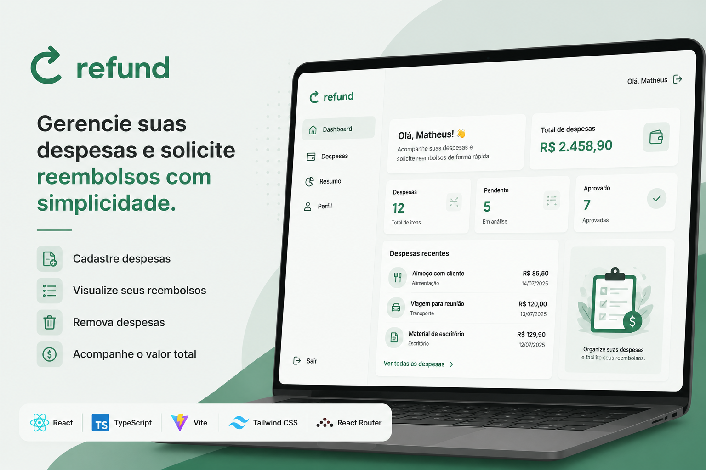
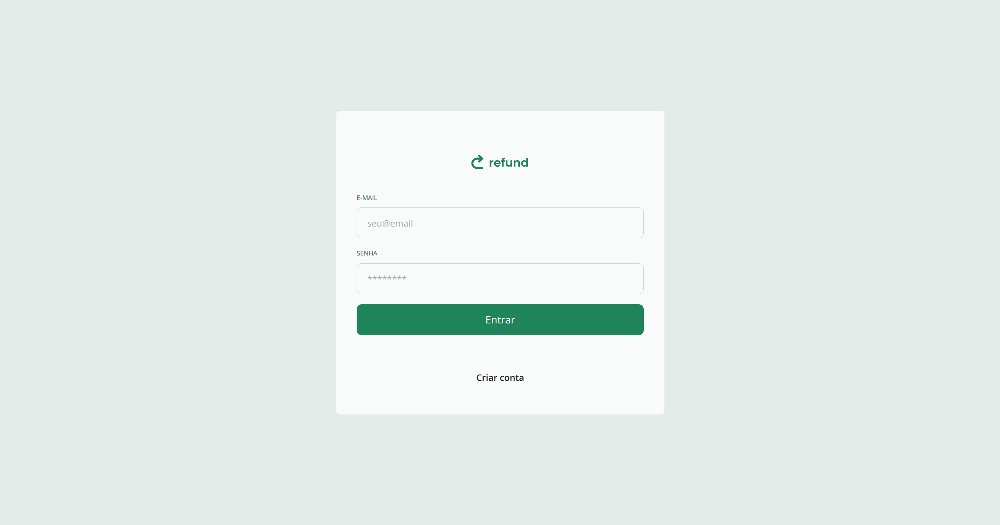
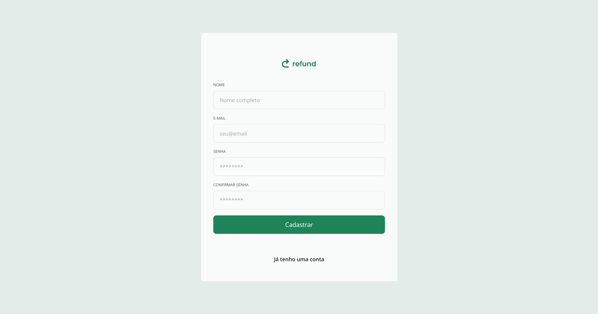
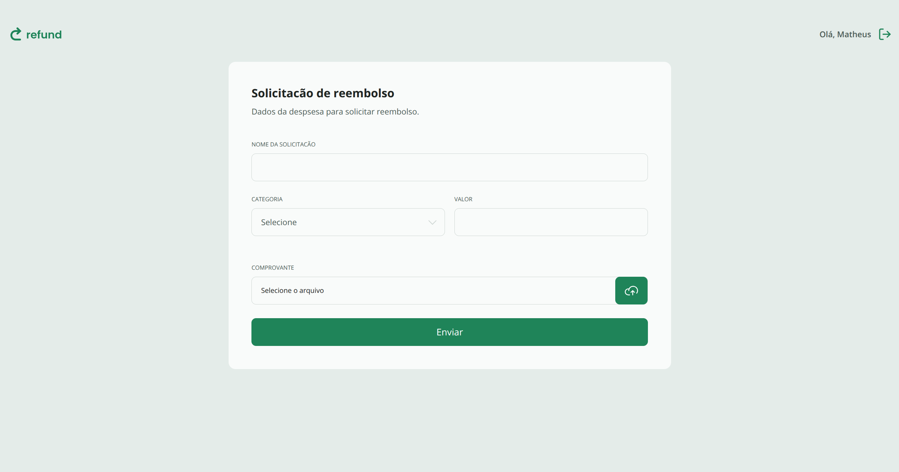
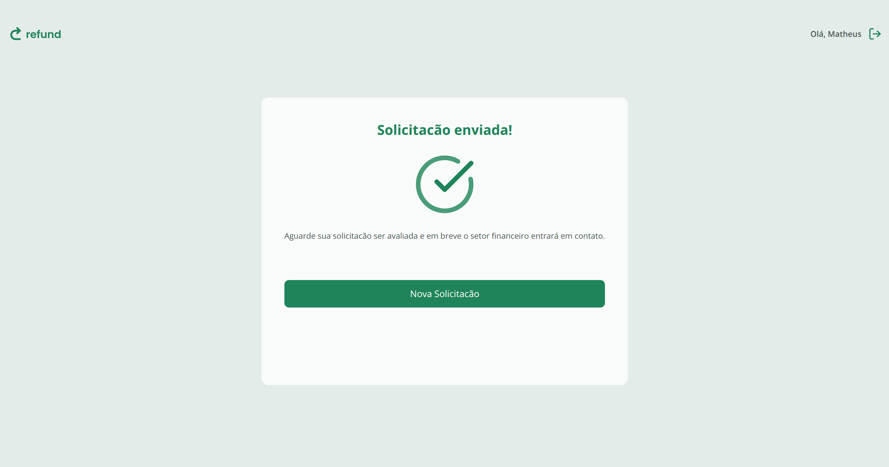
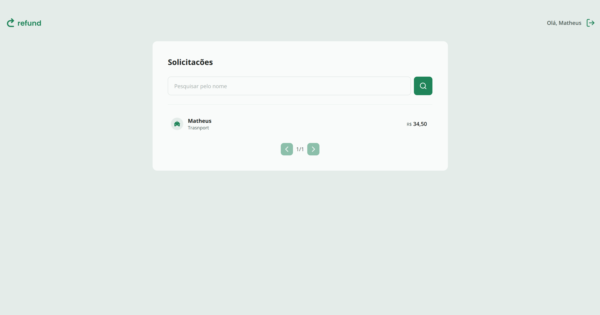

<p align="center">
  
</p>

# 💸 Refund | Frontend

<p align="center">
  Uma aplicação web moderna para gerenciamento de despesas e solicitações de reembolso, desenvolvida com React, TypeScript e Vite.
</p>

<p align="center">
  
  
  
  
  
</p>

---

# 📖 Sobre

O **Refund** é uma aplicação web desenvolvida para facilitar o gerenciamento de despesas destinadas à solicitação de reembolso.

A interface permite cadastrar novas despesas, visualizar todos os registros, remover itens e acompanhar automaticamente o valor total das despesas cadastradas, proporcionando uma experiência simples, rápida e intuitiva.

O projeto foi desenvolvido com foco em boas práticas de desenvolvimento utilizando React, TypeScript e uma arquitetura organizada e escalável.

---

# ✨ Funcionalidades

- ✅ Cadastro de despesas
- ✅ Listagem de despesas
- ✅ Remoção de despesas
- ✅ Cálculo automático do valor total
- ✅ Interface moderna e responsiva
- ✅ Navegação entre páginas com React Router

---

# 🚀 Tecnologias

- React 19
- TypeScript
- Vite
- Tailwind CSS
- React Router
- clsx
- tailwind-merge

---

# 📸 Preview

## Login

<p align="justify">
  
</p>

---

## Criando Usuario

<p align="justify">
  
</p>

---

## Solicitando Reembolso

<p align="justify">
  
</p>

---

## Reembolso Confirmado

<p align="justify">
  
</p>

---

## Visualizando a solicitacão

<p align="justify">
  
</p>

---

# 📂 Estrutura do Projeto

```text
src
├── assets
├── components
├── pages
├── routes
├── services
├── styles
├── utils
├── App.tsx
└── main.tsx
```

---

# ⚙️ Pré-requisitos

- Node.js 18 ou superior
- npm

---

# 📥 Instalação

Clone o repositório:

```bash
git clone https://github.com/Matheus-Souza97/refund-frontend.git
```

Acesse a pasta do projeto:

```bash
cd refund-frontend
```

Instale as dependências:

```bash
npm install
```

---

# ▶️ Executando o Projeto

Inicie o servidor de desenvolvimento:

```bash
npm run dev
```

A aplicação estará disponível em:

```text
http://localhost:5173
```

---

# 📦 Build para Produção

Gerar a versão de produção:

```bash
npm run build
```

Visualizar o build localmente:

```bash
npm run preview
```

---

# 📁 Scripts Disponíveis

| Comando           | Descrição                              |
| ----------------- | -------------------------------------- |
| `npm run dev`     | Inicia o servidor de desenvolvimento   |
| `npm run build`   | Gera a versão otimizada para produção  |
| `npm run preview` | Executa o build localmente para testes |

---

# 🎯 Objetivos do Projeto

- Praticar o desenvolvimento de interfaces com React.
- Aplicar conceitos de componentização.
- Utilizar TypeScript para maior segurança no código.
- Criar uma interface moderna utilizando Tailwind CSS.
- Organizar o projeto seguindo boas práticas de arquitetura.

---

# 🚀 Deploy

A aplicação pode ser publicada facilmente em plataformas como:

- Vercel
- Netlify
- GitHub Pages

---

# 👨‍💻 Autor

**Matheus Souza**

- Email: matheus.souza.dev01@gmail.com
- LinkedIn: https://www.linkedin.com/in/matheus-souza-eng-software

---

# 📄 Licença

Este projeto está sob a licença **MIT**.
